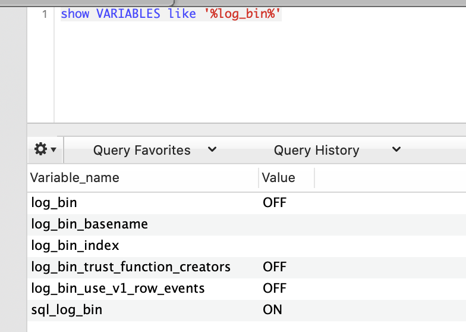
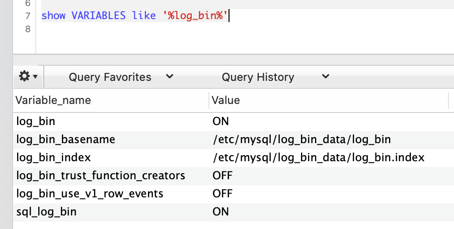
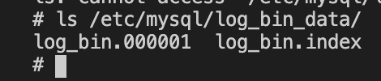

#### 查看是否开启
```sql
show VARIABLES like '%log_bin%'
```


#### 在MySQL配置文件开启binlog日志的两种方式
+ 第一种
  ```
  # 开启binlog
  log_bin=ON
  # binlog日志的基本文件名
  log_bin_basename=/etc/mysql/log_bin_data/log_bin
  # binlog文件的索引文件，管理所有binlog文件
  log_bin_index=/etc/mysql/log_bin_data/log_bin.index
  ```
+ 第二种
  ```
  # 开启binlog 这一行在5.7版本不加没有效果
  log_bin=ON

  log-bin=/etc/mysql/log_bin_data/log_bin
  ```
  *binlog 文件路径为 /etc/mysql/log_bin_data/*

#### 查看结果
```sql
show VARIABLES like '%log_bin%'
```


查看bin log 文件地址
``` shell
ls /etc/mysql/log_bin_data/log_bin
```


#### 解码查看binlog文件
```
 mysqlbinlog log_bin.000002 --base64-output=decode-rows -v
 ```


